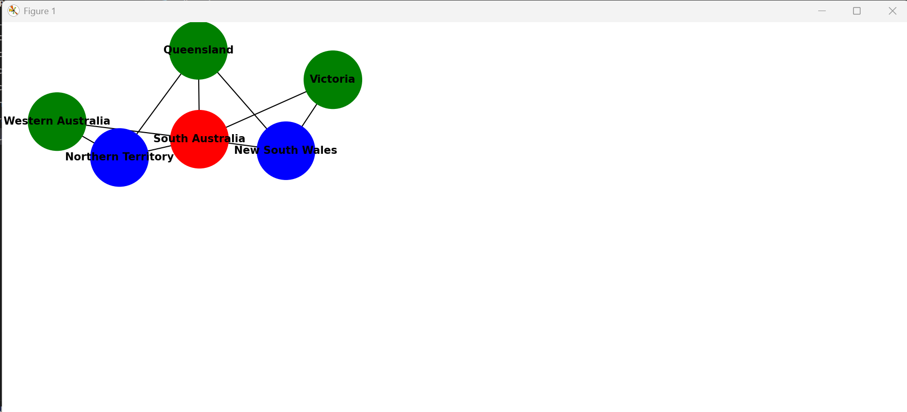

# Map Coloring Using Constraint Satisfaction

## Description

This project solves the Map Coloring Problem using Constraint Satisfaction techniques such as DFS, Forward Checking, and Singleton Propagation, enhanced with MRV and LCV heuristics. It colors USA and Australia maps using the minimum number of colors while displaying execution time, backtracking count, and visual graph outputs.

---

## Features

- Graph coloring using CSP
- DFS, Forward Checking, Singleton Propagation
- MRV & LCV heuristics
- Automatic chromatic number calculation
- Execution time and backtracking statistics
- Tabular color output
- Graph visualization using NetworkX and Matplotlib
- Supports USA and Australia maps

---

## Screenshots

### USA Map Coloring

---

### Australia Map Coloring

---

## Requirements

Install dependencies:

pip install networkx matplotlib prettytable

---

## How to Run

1. Keep all files in one folder:

main.py  
dfs_without_heuristics.py  
dfs_with_heuristics.py  
chromatic_number_util.py  
utils.py  
constants.py  
README.md  
1.png  
2.png  

2. Run:

python main.py

3. Follow prompts to select:

- Region (USA / Australia)
- Heuristic Mode
- Algorithm Type

The program will compute coloring, show statistics, and display the graph.

---

## Algorithms Used

Without Heuristics:
- DFS
- DFS + Forward Checking
- DFS + Forward Checking + Singleton Propagation

With Heuristics:
- DFS + MRV + LCV
- DFS + FC + MRV + LCV
- DFS + FC + SP + MRV + LCV

---

## Academic Purpose

This project demonstrates practical applications of:

- Constraint Satisfaction Problems
- Graph Coloring
- Backtracking Search
- Forward Checking
- Singleton Domain Propagation
- Heuristic Optimization
